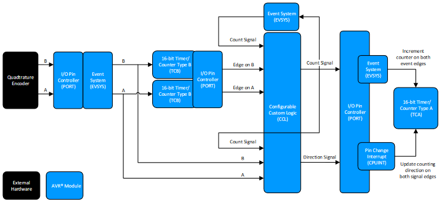
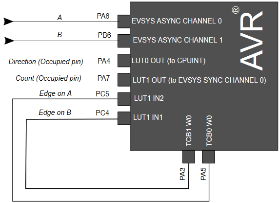

# ATtiny1617 Quadrature Decoding using CCL with TCA and TCB

Incremental quadrature encoders are used in a great number of applications across many disciplines asthey provide a low-cost way of measuring motion in systems with moving parts. Some typical examplesinclude measuring the position of a physical control wheel or measuring the rotor angle and velocity in anelectrical motor.

The example is explained in more details in the application note [AN2434](#Related-Documentation)

## Related Documentation

- [AN2434 - Interfacing Quadrature Encoder using CCL with TCA andTCB](http://ww1.microchip.com/downloads/en/Appnotes/Interf-Quad-Encoder-CCL-w-TCA-TCB-DS00002434C.pdf)
- [ATtiny1617 Product Page](https://www.microchip.com/wwwproducts/en/ATtiny1617)

## Software Used

- [Atmel Studio 7.0.2397 or later](https://www.microchip.com/mplab/avr-support/atmel-studio-7)
- ATtiny_DFP 1.5.315 or later
- AVR/GNU C Compiler 5.4.0 (buildt into studio)

## Hardware Used

-  [ATtiny1617 QFN](https://www.microchip.com/wwwproducts/en/ATtiny1617)
-  [STK600](https://www.microchip.com/developmenttools/ProductDetails/ATSTK600)
-  [STK600 Routing card](https://www.microchip.com/DevelopmentTools/ProductDetails/atstk600-rc103)
-  [STK600 QFN24](https://www.microchip.com/developmenttools/ProductDetails/ATSTK600-SC62)
- Quadtrature Encoder

## Setup

Setup the connections as described in the diagram above

## Operation

1. Open `QuadratureDecodingusingCCLwithTCAandTCB.atsln` in Atmel Studio
2. Connect the ATtiny1617 with your programmer of choice, we used a STK600.
3. In your menu bar in Atmel Studio go to `Debug->Start Without Debugging` or press `CTRL + ALT + F5`
4. Interact with the encoder and see the effect on *count* `PA7` *direction* `PA4`

## Conclusion

We have shown how you can use a attiny1617 to do quadrature decoding. Refere to the application note [AN2434](#Related-Documentation) for more details about the implementation